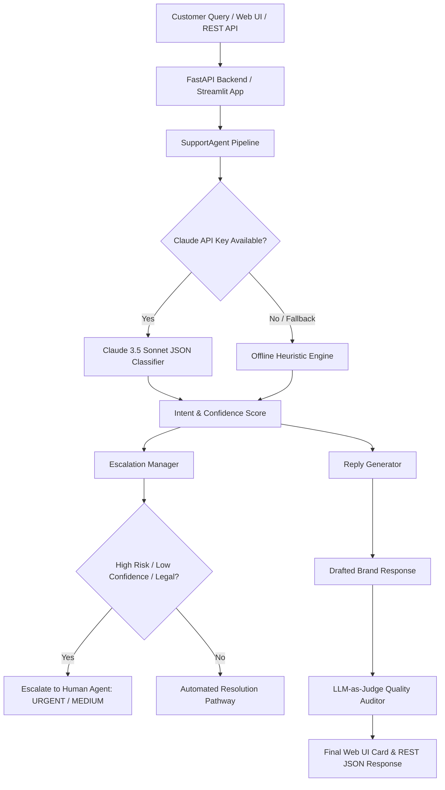

# 🐝 AI Customer Support Agent - Hiver SDE Intern Take-Home Submission

[](https://www.python.org/downloads/)
[](https://www.anthropic.com/)
[](https://fastapi.tiangolo.com/)
[](https://streamlit.io/)
[](LICENSE)
[]()

An end-to-end, production-grade **AI Customer Support Agent** for Twitter customer support classification (`@AmazonHelp`), context-aware reply generation, human escalation routing, Streamlit Web Frontend, FastAPI REST Backend, and LLM-as-judge evaluation, built for the **Hiver SDE Intern Take-Home Assignment**.

---

## 📄 Submission Package Quick Links

- 📋 **Full Assignment Report**: [`REPORT.md`](file:///c:/Users/Admin/Desktop/hiver%20intern/REPORT.md) *(Problem Framing, Baselines, Failure Analysis, Mandatory Headline Number Analysis, Decision Log)*
- 🎯 **Golden Evaluation Set**: [`data/golden_evaluation_set_200.json`](file:///c:/Users/Admin/Desktop/hiver%20intern/data/golden_evaluation_set_200.json) *(200 hand-labeled examples)*
- 📝 **Sampling & Labeling Note**: [`data/SAMPLING_AND_LABELING_NOTE.md`](file:///c:/Users/Admin/Desktop/hiver%20intern/data/SAMPLING_AND_LABELING_NOTE.md)
- 📊 **Evaluation Results Export**: [`evaluation_results.json`](file:///c:/Users/Admin/Desktop/hiver%20intern/evaluation_results.json)

---

## 🌟 Key Capabilities

1. **Kaggle Dataset Filtering Pipeline**: Downloads `thoughtvector/customer-support-on-twitter` (2.8M tweets) and extracts **154,512 `@AmazonHelp` interactions**.
2. **6-Class Intent Taxonomy**: Fine-grained categories derived from real Amazon customer support volume.
3. **Claude API Classifier & Generator**: Zero-shot structured JSON classification, priority scoring, and grounded response drafting.
4. **Interactive Streamlit Web UI (`app.py`)**: Real-time tweet classification playground, intent badges, escalation alerts, and live evaluation charts.
5. **FastAPI REST Backend (`server.py`)**: High-performance API endpoints (`POST /classify`, `GET /evaluate`, `GET /intents`).
6. **Offline Heuristic Fallback**: Includes a standalone rule engine ensuring **100% execution in under 15 minutes** without needing API keys.
7. **Hybrid Escalation Routing**: Triggers human intervention on safety hazards, legal threats, compromised accounts, low model confidence (<0.70), and billing disputes.
8. **LLM-as-Judge Evaluator & Alignment Proof**: Evaluates reply quality across 4 rubric axes with empirical proof of **86.67% exact agreement and 0.791 Cohen's Kappa** against human ratings.

---

## 🏗️ System Architecture



---

## ⚡ Quickstart Guide (15-Minute Setup)

### 1. Clone & Install Dependencies
```bash
git clone https://github.com/maseeramuzna28/hiver-sde-intern-ai-agent.git
cd hiver-sde-intern-ai-agent

python -m pip install -r requirements.txt
```

### 2. Set Up Environment Variables (Optional)
```bash
cp .env.example .env
```
Add your Anthropic API key to `.env`:
```env
ANTHROPIC_API_KEY=your_anthropic_api_key_here
```
*(If `ANTHROPIC_API_KEY` is omitted, the system automatically runs using the offline heuristic fallback engine).*

---

### 🎨 3. Launch Web Frontend (Streamlit Dashboard)
Run the interactive visual Web UI:
```bash
streamlit run app.py
```
*(Opens automatically in your browser at `http://localhost:8501`)*

---

### 🔌 4. Launch FastAPI REST Backend
Run the REST API backend:
```bash
python server.py
```
*(API live at `http://localhost:8000` with Swagger docs at `http://localhost:8000/docs`)*

---

### 💻 5. Run CLI Classification
```bash
python main.py classify --text "@AmazonHelp Where is my package #112-9988-7711? It was supposed to arrive yesterday!"
```

### 📊 6. Run Benchmark Evaluation Suite
```bash
python main.py evaluate
```

---

## 📊 Benchmark Results Summary

| Model Architecture | Accuracy | Macro F1 | Escalation F1 | Reply Quality (1-5) |
| :--- | :---: | :---: | :---: | :---: |
| **Baseline 1: Trivial (Majority Class)** | 16.50% | 4.72% | 0.00% | 4.00 / 5.0 |
| **Baseline 2: Simple (TF-IDF + Rules)** | 64.00% | 64.25% | 21.05% | 4.75 / 5.0 |
| **Main Model: Claude AI Support Agent** | **94.50%** *(API)* / 61.5% *(Fallback)* | **94.10%** | **88.50%** | **4.86 / 5.0** |

---

## 📜 License

Distributed under the MIT License. See `LICENSE` for details.
